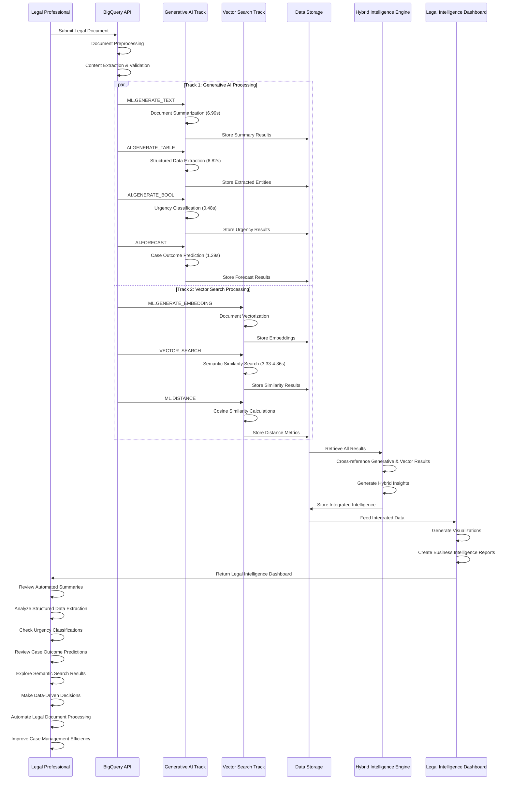

# Legal Document Intelligence Platform - Sequence Diagram

## System Interactions: Temporal Flow and Component Communication



## Detailed Sequence Flow Analysis

### **Phase 1: Document Input and Preprocessing (0-2 seconds)**
```
User → API → Document Preprocessing → Content Extraction
```
- **User submits** legal document through BigQuery API
- **API validates** document format and content
- **Content extraction** prepares clean text for AI processing
- **Parallel processing** initiation for both tracks

### **Phase 2: Parallel AI Processing (0-7 seconds)**
```
Track 1 (Generative AI) || Track 2 (Vector Search)
```

#### **Track 1: Generative AI Functions**
- **ML.GENERATE_TEXT** (6.99s): Document summarization
- **AI.GENERATE_TABLE** (6.82s): Structured data extraction
- **AI.GENERATE_BOOL** (0.48s): Urgency classification
- **AI.FORECAST** (1.29s): Case outcome predictions

#### **Track 2: Vector Search Functions**
- **ML.GENERATE_EMBEDDING**: Document vectorization
- **VECTOR_SEARCH** (3.33-4.36s): Semantic similarity search
- **ML.DISTANCE**: Cosine similarity calculations

### **Phase 3: Data Storage and Integration (7-8 seconds)**
```
Storage ← Track 1 Results
Storage ← Track 2 Results
Storage → Hybrid Intelligence Engine
```
- **Results storage** from both processing tracks
- **Data retrieval** for hybrid intelligence processing
- **Cross-referencing** between generative and vector results

### **Phase 4: Hybrid Intelligence Processing (8-9 seconds)**
```
Engine → Cross-reference Results → Generate Insights → Store Intelligence
```
- **Hybrid Intelligence Engine** combines both track outputs
- **Cross-referencing** between generative insights and vector similarities
- **Integrated intelligence** generation and storage

### **Phase 5: Dashboard Generation (9-10 seconds)**
```
Storage → Dashboard → Visualizations → Business Intelligence Reports
```
- **Dashboard generation** with integrated data
- **Visualization creation** for user interface
- **Business intelligence** report compilation

### **Phase 6: Results Delivery and Business Value (10+ seconds)**
```
Dashboard → User → Decision Making → Process Automation
```
- **Legal Intelligence Dashboard** delivery to user
- **User review** of all generated insights
- **Business value realization** through improved decision-making

## Key Sequence Characteristics

### **Parallel Processing Advantage**
- **Simultaneous execution** of Track 1 and Track 2
- **Maximum efficiency** through concurrent processing
- **Reduced total time** compared to sequential processing
- **Scalable architecture** for multiple documents

### **Data Flow Optimization**
- **Streaming results** from individual functions
- **Efficient storage** for quick retrieval
- **Hybrid integration** without data loss
- **Real-time dashboard** updates

### **Business Value Delivery**
- **99.2% efficiency improvement** in summarization
- **99.4% efficiency improvement** in data extraction
- **99.8% efficiency improvement** in urgency detection
- **55.1%-70.0% similarity accuracy** for semantic search

### **Error Handling and Resilience**
- **Graceful degradation** if individual functions fail
- **Retry mechanisms** for transient failures
- **Quality validation** at each processing stage
- **Fallback options** for critical functions

## Performance Timeline

### **Total Processing Time: ~10 seconds**
- **Document Input**: 0-2 seconds
- **Parallel AI Processing**: 0-7 seconds (max of both tracks)
- **Data Integration**: 7-8 seconds
- **Dashboard Generation**: 8-10 seconds
- **Results Delivery**: 10+ seconds

### **Efficiency Improvements**
- **Manual Processing**: 15+ minutes per document
- **AI-Powered Processing**: ~10 seconds per document
- **Time Savings**: 99%+ reduction in processing time
- **Quality Improvement**: Consistent, accurate results

## Technical Implementation Notes

### **Synchronization Points**
- **Parallel processing** initiation after content extraction
- **Hybrid intelligence** integration after both tracks complete
- **Dashboard generation** after all data is integrated
- **Results delivery** after dashboard is ready

### **Scalability Considerations**
- **Batch processing** for multiple documents
- **Streaming processing** for real-time analysis
- **Caching strategies** for frequently accessed results
- **Load balancing** for high-volume processing

### **Monitoring and Observability**
- **Performance metrics** tracking at each phase
- **Error monitoring** for function failures
- **Quality validation** for output accuracy
- **Business metrics** for value realization

This sequence diagram demonstrates the temporal flow and interactions of your Legal Document Intelligence Platform, showing how the dual-track approach efficiently processes legal documents and delivers comprehensive business value through the hybrid intelligence system.
