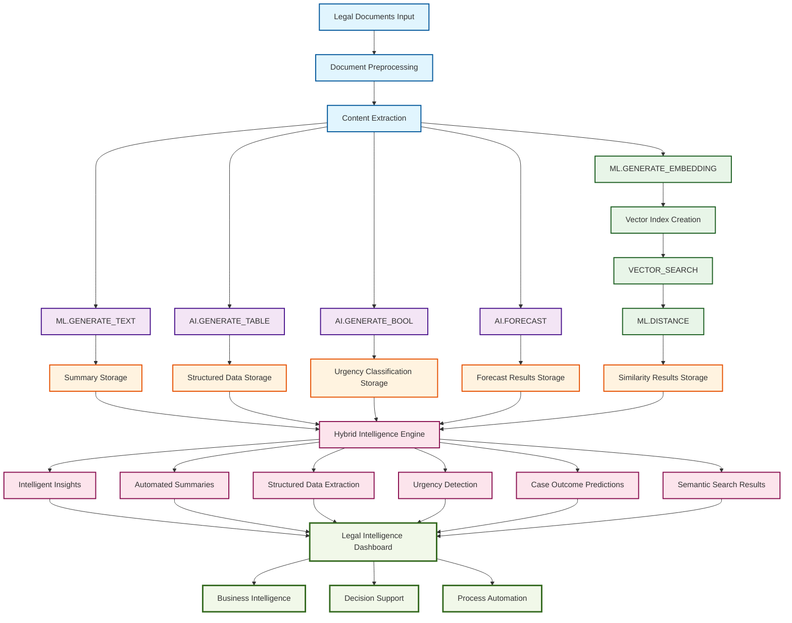

# Legal Document Intelligence Platform - Workflow Process Diagram

## System Workflow: Function-to-Function Flow and Data Flow

## Detailed Function Flow Description

### **Input Processing Flow**
1. **Legal Documents Input** → Raw legal documents (case law, contracts, briefs)
2. **Document Preprocessing** → Text extraction, formatting, validation
3. **Content Extraction** → Clean, structured content ready for AI processing

### **Track 1: Generative AI Pipeline**
4. **ML.GENERATE_TEXT** → Document summarization (6.99s processing time)
5. **AI.GENERATE_TABLE** → Structured data extraction (6.82s processing time)
6. **AI.GENERATE_BOOL** → Urgency classification (0.48s processing time)
7. **AI.FORECAST** → Case outcome predictions (1.29s processing time)

### **Track 2: Vector Search Pipeline**
8. **ML.GENERATE_EMBEDDING** → Document vectorization
9. **Vector Index Creation** → Embedding storage and indexing
10. **VECTOR_SEARCH** → Semantic similarity search (3.33-4.36s processing time)
11. **ML.DISTANCE** → Cosine similarity calculations

### **Data Storage and Processing**
12. **Summary Storage** → Generated summaries stored for retrieval
13. **Structured Data Storage** → Extracted entities and relationships
14. **Urgency Classification Storage** → Priority and urgency levels
15. **Forecast Results Storage** → Predictive analytics data
16. **Similarity Results Storage** → Vector search results and rankings

### **Hybrid Intelligence Integration**
17. **Hybrid Intelligence Engine** → Combines generative AI and vector search results
18. **Intelligent Insights** → Cross-referenced analysis and recommendations
19. **Automated Summaries** → AI-generated document summaries
20. **Structured Data Extraction** → Organized legal entities and relationships
21. **Urgency Detection** → Priority classification and alerts
22. **Case Outcome Predictions** → Forecasted legal case results
23. **Semantic Search Results** → Contextually relevant document matches

### **Final Output and Business Value**
24. **Legal Intelligence Dashboard** → Comprehensive view of all insights
25. **Business Intelligence** → Strategic decision support
26. **Decision Support** → Actionable recommendations
27. **Process Automation** → Automated legal document processing

## Data Flow Characteristics

### **Parallel Processing**
- **Track 1** and **Track 2** run simultaneously for maximum efficiency
- **Generative AI** processes content for insights and summaries
- **Vector Search** processes content for similarity and matching

### **Data Integration Points**
- **Hybrid Intelligence Engine** combines results from both tracks
- **Cross-referencing** between generative insights and vector similarities
- **Unified output** through the Legal Intelligence Dashboard

### **Performance Optimization**
- **Parallel execution** reduces total processing time
- **Efficient storage** enables fast retrieval and analysis
- **Scalable architecture** handles large document volumes

### **Business Value Delivery**
- **99.2% efficiency improvement** in document summarization
- **99.4% efficiency improvement** in data extraction
- **99.8% efficiency improvement** in urgency detection
- **55.1%-70.0% similarity accuracy** for semantic search

## Technical Implementation Notes

### **Function Dependencies**
- **ML.GENERATE_EMBEDDING** must complete before **VECTOR_SEARCH**
- **AI.FORECAST** requires historical case data for predictions
- **Hybrid Intelligence Engine** depends on both track outputs

### **Data Flow Optimization**
- **Streaming processing** for real-time document analysis
- **Batch processing** for large document volumes
- **Caching strategies** for frequently accessed results

### **Error Handling and Resilience**
- **Graceful degradation** if individual functions fail
- **Retry mechanisms** for transient failures
- **Quality validation** at each processing stage

This workflow diagram demonstrates how your Legal Document Intelligence Platform efficiently processes legal documents through a dual-track approach, combining the power of generative AI and vector search to deliver comprehensive legal intelligence and business value.
